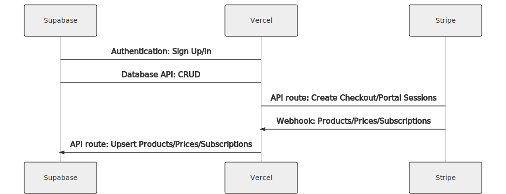

# Gambit Training App

The official Acid Gambit Training App by [@acidgambit](https://instagram.com/acidgambit).

## Introduction

Gambit is an open-source application to effortlessly train on top tier programming.

## Tech Stack

- [Next.js](https://nextjs.org/) – framework
- [Tailwind](https://tailwindcss.com/) – CSS
- [Supabase](https://supabase.com/) – database
- [Vercel](https://vercel.com/) – hosting
- [Resend](https://resend.com/) – emails

## Features

- Secure user management and authentication with [Supabase](https://supabase.io/docs/guides/auth)
- PostgreSQL data access & management with [Supabase](https://supabase.io/docs/guides/database)
- Integration with [Stripe Checkout](https://stripe.com/docs/payments/checkout) and the [Stripe customer portal](https://stripe.com/docs/billing/subscriptions/customer-portal)
- Automatic syncing of pricing plans and subscription statuses via [Stripe webhooks](https://stripe.com/docs/webhooks)

## Live Deployment

- https://app.acidgambit.com

## Demo GIF

## Architecture

